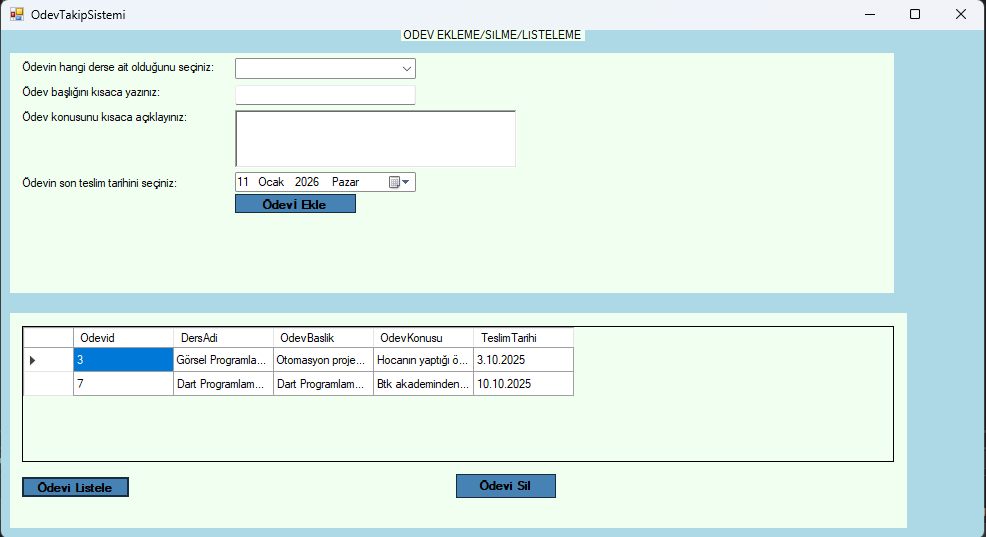

# Ödev Takip Sistemi (C# WinForms)

Bu proje, öğrencilerin derslerine ait ödevleri ekleyip, listeleyip ve silebileceği 
basit bir masaüstü uygulamasıdır.

## Kullanılan Teknolojiler
- C#
- Windows Forms
- Entity Framework (Database First)
- SQL Server

## Özellikler
- Ödev ekleme
- Ödev listeleme
- Ödev silme
- Teslim tarihi takibi

## Amaç
Bu proje, C# WinForms ve Entity Framework kullanarak 
CRUD işlemlerini öğrenmek ve masaüstü uygulama geliştirme pratiği kazanmak amacıyla geliştirilmiştir.

## Veritabanı
Uygulama SQL Server kullanmaktadır.  
Gerekli tablo yapıları `database.sql` dosyasında yer almaktadır.

## Ekran Görüntüsü

